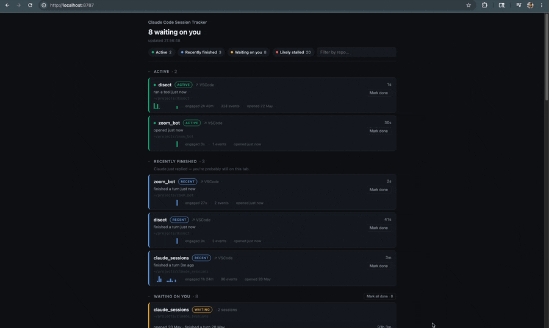

# Claude Code Session Tracker

**Stop losing the Claude Code tabs that are waiting on you.**

You open a dozen Claude Code sessions, walk away, and forget which ones finished
and need your reply. This is a tiny local dashboard that surfaces them — sorted
by what needs you first.



> Claude Code's built-in Agent View tracks background (`--bg`) sessions. This
> tracks the **normal interactive tabs** Agent View doesn't — the ones you
> actually lose.

Local · offline · private · zero dependencies (Python stdlib only).

## Quickstart

```sh
git clone https://github.com/rohitsaini1196/claude-session-tracker
cd claude-session-tracker
./install.sh     # wires 3 hooks into ~/.claude/settings.json (backed up)
./run.sh         # dashboard at http://127.0.0.1:8787
```

Open a **new** Claude Code session — hooks load at start. Uninstall anytime:
`./uninstall.sh`.

## What you get

- 🟢 **Tiers, top-down:** Active → Recently finished → Waiting on you → Possibly
  stuck → Likely stalled. What you're driving sits on top; forgotten sessions
  surface loudly.
- 🔎 **Filter** by status chip or repo name.
- 🪄 **Click a row** → focuses that VSCode window (only if it's already open —
  never spawns a new one).
- 📊 **Per session:** engaged time, event count, a 30-min activity sparkline,
  and what it last did.
- ✅ **Mark done** (with undo) and **bulk done** — nothing ever auto-clears.

## How it works

The event log is the source of truth; the server only reads it.

1. Three hooks append one compact JSON line each to `~/.claude-sessions/events.jsonl`:
   `SessionStart`, `Stop` (waiting on you), `PostToolUse` (liveness).
2. The server reads that file and derives a status per session.
3. The dashboard shows the prioritized list.

Server off? Hooks still append and it catches up on next read — **zero data
loss, zero added turn latency.**

## Privacy

Hooks write **only** `session_id`, `cwd`, event type, timestamp, and (on
`SessionStart`) `source` + `transcript_path`. Never your prompts, tool I/O, or
Claude's messages. Safe to point at private repos.

## Honest limits

- ✅ *"Claude finished, waiting on you"* — reliable. `Stop` marks true turn-end.
- ✅ *"Went silent for a long time"* — detected; confidence grows with time.
- ⚠️ *"Stuck inside one slow tool"* — **can't** be told apart from legitimately
  busy. `Stop` fires only at turn-end and `PostToolUse` goes quiet mid-tool.
  Confidence tiers say so honestly instead of guessing.

## Config

Thresholds, paths, and port live in [config.py](config.py). They lean short —
over-flagging is cheap, missing a waiting session is not.

## License

MIT — see [LICENSE](LICENSE).
